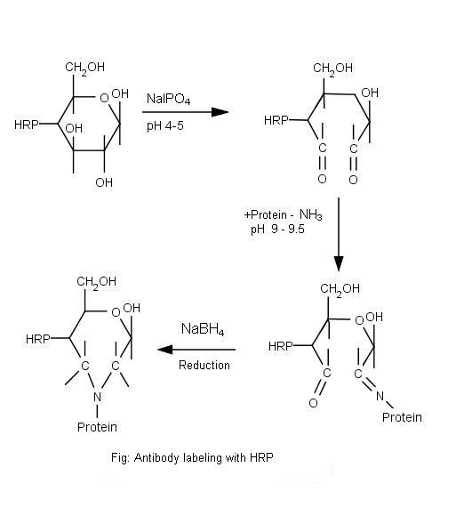

### Introduction

Based on the principle that an antibody specifically reacts with its corresponding antigen, several procedures have been developed in which Antibodies or antigens labeled with appropriate indicators are used for the localization, detection or quantitation of substances of biological interest.  The earliest indicator molecules (labels) developed were the fluorochromes,introduced by A Coons and collaborators in 1941,followed by the use of  enzymes that produce colored reactions, the first one being Horse radish peroxidase .The first labeling of antibodies was achieved by John Marrack in 1934. The most common used labels (tracers) are Radio elements, fluorochromes, heavy metals and enzymes.

 

Enzymes as indicators were introduced by PK Nakane and GB Pierce (in 1966) in the USA and S Avrameas and J Uriel in France. Because of the catalytic nature, Enzymes offer the possibility of high amplification associated with either simple or sophisticated systems of detection and quantitation. Depending on the substrates available, these enzymes can be used for the localization or the measurement of antigen or antibodies or both. Antibodies or antigens are labeled with enzymes either by covalent or by biospecific non-covalent linkages. A number of cross-linking agents have been used to obtain covalent antibody-enzyme conjugates, but currently used agents are only glutaraldehyde,m-periodate and maleimide derivatives.

 

Horseradish peroxidase (HRP) and Calf intestine alkaline phosphatase are the enzymes mostly used in immunoenzymatic techniques. HRP is a glycoprotein which catalyzes the transfer of two electrons from a substrate to hydrogen peroxide and produces an oxidized substrate along with water. In the case of protein detection, HRP substrates are designed to generate a chromogenic, chemiluminescent or fluorescent signal upon oxidation and are relatively small having a molecular weight of 40kDa. This small size allows greater penetration into sample tissues and cells and reduces the likelihood of interfering with the conjugated protein function. HRP also has four lysines that are available for conjugation, which improves the efficiency of cross linking to a protein of interest.

 

### Principle

Glycoproteins such as horseradish peroxidase and glucose oxidase and most antibody molecules can be activated for conjugation by treatment with periodate. Polysaccharide residues in the HRP oxidized with sodium periodate to produce reactive aldehyde groups that can conjugate with amino groups of IgG molecule and produce Schiff bases. This reaction should be performed in the dark to prevent periodate breakdown and for a limited period of time (15-30 minutes) to avoid loss of enzymatic activity (figure 1). The relatively labile Schiff bases can be stabilized by reduction to a secondary amine linkage with sodium borohydride (Reductive animation). The borohydride is removed (Desalting) by gel filtration column. The efficiency of the enzyme conjugated antibody is tested by direct Dot-ELISA and is expressed as the titre value of the conjugate.

